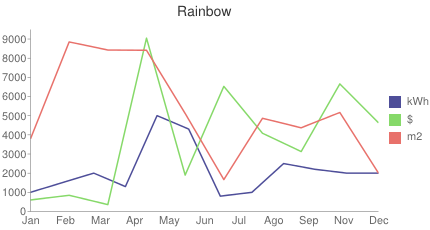

# chaaart

Turn your **json** encoded data into an awesome chart PNG.

chaaart uses [Google Chart API](https://developers.google.com/chart/) and [quiche](https://github.com/ryanrolds/quiche).

## install
At the moment chaaart is not ready no be npm'able. So you must download the source and run `$ npm install -g` in order to use it from the CLI (you may need to run it with `sudo`), or you just simply run it with node `$node chaaart.js [options]`;

## usage

`$ chaaart --chart line --title Rainbow --json data.json --output chart.png`

There's also an alternative way to run chaaart with `$ node chaaart.js [options]`

You can customize your chart with the many options chaaart provides

```
  -h, --help            output usage information
  -V, --version         output the version number

  -t, --title [value]   Add chart title
  -c, --chart <value>   Add chart type [line|bar|pie|qr]
  -o, --output <value>  Output file name
  -j, --json <value>    Input file name
```
**note:** At the moment chaaart only supports **line chart**.

## example

Given the following json (sample.json):

```json
{
  "data": [
      {
        "values": [1000, 1500, 2000, 1300, 5000, 4300, 800, 1000, 2500, 2200, 2000, 2000],
        "legend": "kWh",
        "color": "4e4e99"
      },
      {
        "values": [600, 846, 359, 9045, 1900, 6528, 4080, 3127, 6657, 4627],
        "legend": "$",
        "color": "86d969"
      },
      {
        "values": [3792, 8848, 8426, 8413, 5115, 1664, 4864, 4367, 5166, 1999],
        "legend": "m2",
        "color": "e8716b"
    }
  ],
  "xAxisLabels": ["Jan", "Feb", "Mar", "Apr", "May", "Jun", "Jul", "Ago", "Sep", "Nov", "Dec"]
}
```

running `$chaaart --title Rainbow --chart line --json sample.json --output chart.png` will output



## contribute

We know, chaaart is a little puppie. But you can fork it, code it, make a pull request and watch it grow strong.

## license

The MIT License (MIT)

Copyright (c) 2015 Ricardo Andrés Bello

Permission is hereby granted, free of charge, to any person obtaining a copy
of this software and associated documentation files (the "Software"), to deal
in the Software without restriction, including without limitation the rights
to use, copy, modify, merge, publish, distribute, sublicense, and/or sell
copies of the Software, and to permit persons to whom the Software is
furnished to do so, subject to the following conditions:

The above copyright notice and this permission notice shall be included in
all copies or substantial portions of the Software.

THE SOFTWARE IS PROVIDED "AS IS", WITHOUT WARRANTY OF ANY KIND, EXPRESS OR
IMPLIED, INCLUDING BUT NOT LIMITED TO THE WARRANTIES OF MERCHANTABILITY,
FITNESS FOR A PARTICULAR PURPOSE AND NONINFRINGEMENT. IN NO EVENT SHALL THE
AUTHORS OR COPYRIGHT HOLDERS BE LIABLE FOR ANY CLAIM, DAMAGES OR OTHER
LIABILITY, WHETHER IN AN ACTION OF CONTRACT, TORT OR OTHERWISE, ARISING FROM,
OUT OF OR IN CONNECTION WITH THE SOFTWARE OR THE USE OR OTHER DEALINGS IN
THE SOFTWARE.
